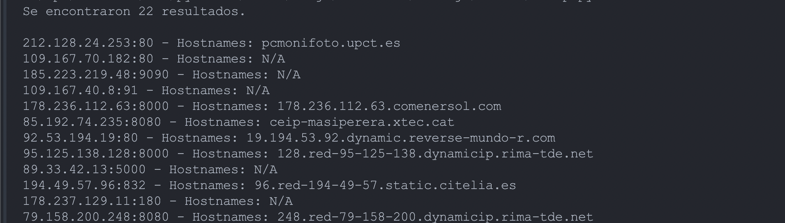

# Script to quickly display IPs, ports and hostnames through Shodan

This script can be used to add a library of keywords and you do a quick search in shodan, and go deep from there.

Obviously it is recommended to modify the dorks to preference, make use of a list or to search manually.

## Output example

